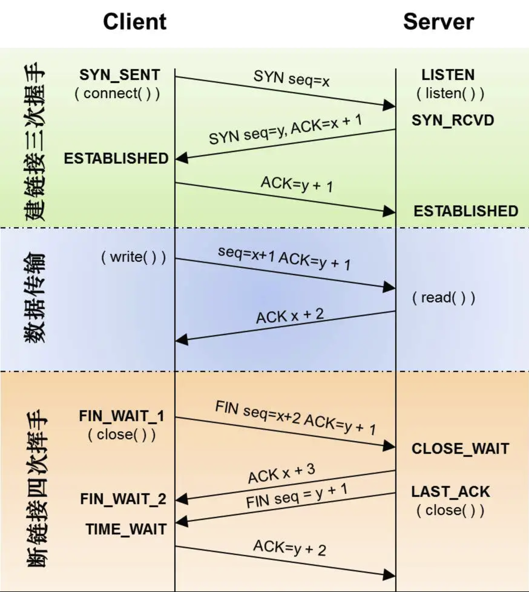
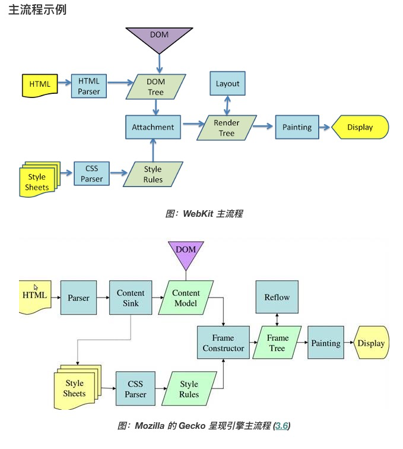
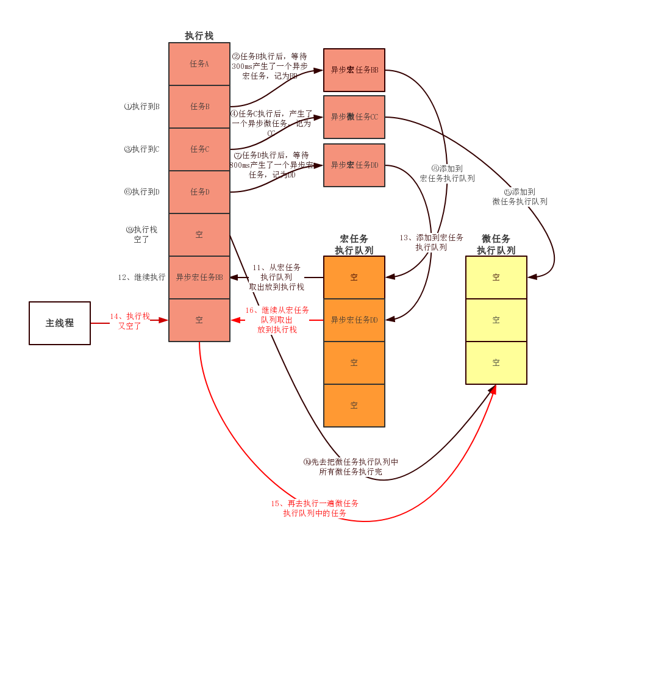

[toc]

### 执行一个 URL，浏览器做了什么事情？

1. HTTP 请求阶段
    1. DNS 解析
    2. TCP 连接（三次握手）
    3. 发起 HTTP 数据请求
2. HTTP 响应阶段
    1. 请求行，包含用于请求的方法，URL 以及 HTTP 版本
    2. 状态行，包含表明响应结果的状态码，原因短语和 HTTP 版本
    3. 首部字段，包含表示请求和响应各种条件和属性的各类首部
    4. 包含 HTTP 的 RFC 里未定义的首部 cookie 等
3. 浏览器渲染阶段
    1. 拿到 index.html，浏览器从上到下解析其内容。
    2. 浏览器在内存中开辟一块栈内存，用来给代码提供环境。同时分配一条主线程去执行代码，因此 js 是单线程执行的。
    3. 当执行过程中遇到外部链接的时候，主线程会引导另外一条线程去向服务器请求外部资源，这样会生成一个任务队列（Task Queue）。
    4. 主线程在执行完成所有代码后会生成一个 DOM 树，而相关外部资源未必会请求完毕。这样主线程会开始向任务队列中拿取已经完成的资源。向任务队列取资源是一个不断循环的过程，所以叫做事件循环（Event Loop）。
    5. 外部资源 css 请求回来之后会由主线程生成一个 css 树，所以会由 DOM Tree 和 CSS Tree 生成 renderTree。
    6. GPU 开始绘制 renderTree

---

相关思考：css 在任务队列是查看谁先完成就执行谁，那么在 HTML 中的顺序会影响其最终渲染效果吗？

---

### 进程和线程以及栈内存

process： 进程，通俗讲就是在机器上开启的程序

thread：线程，在一个程序中执行的最小单位，一条线程是指进程中一个单一顺序的控制流，每条线程执行其单一的任务

stack：栈内存，在函数中定义的一些基本类型的变量和对象的引用变量

---

### 单核和多核 cpu

单核 cpu：一次只能执行一个任务，

多核 cpu：并行执行多任务

---

### 三次握手图解

---

### 浏览器渲染图解

---

### 任务队列图解

