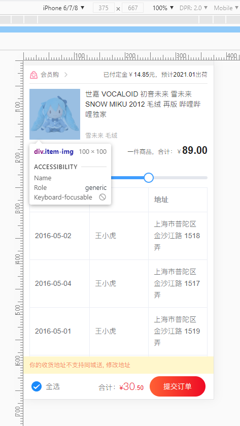
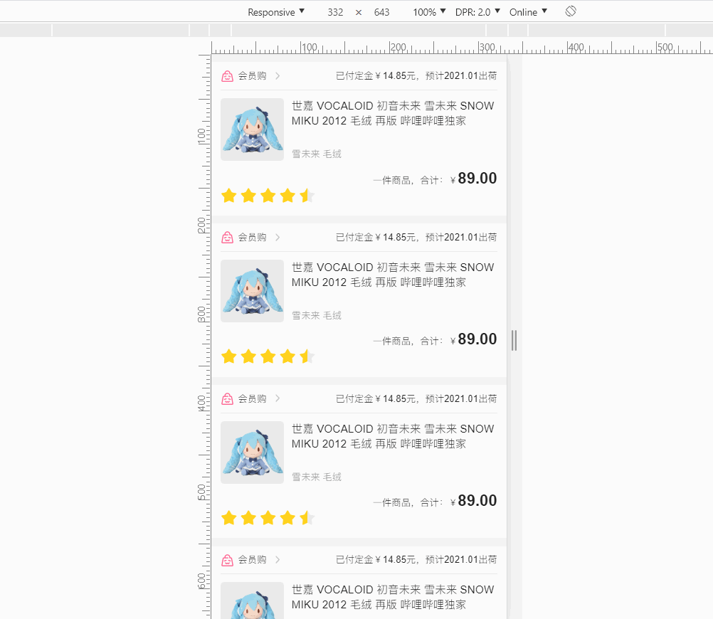

[toc]

## rem 和 em 和 vw 的区别

### em

> em 作为 font-size 的单位时，其代表父元素的字体大小，em 作为其他属性单位时，代表自身字体大小 ——MDN

```html
<div class="p1">
    <div class="s1">1</div>
    <div class="s2">1</div>
</div>
<div class="p2">
    <div class="s5">1</div>
    <div class="s6">1</div>
</div>
```

```css
.p1 {
    font-size: 16px;
    line-height: 32px;
}
.s1 {
    font-size: 2em;
}
.s2 {
    font-size: 2em;
    line-height: 2em;
}

.p2 {
    font-size: 16px;
    line-height: 2;
}
.s5 {
    font-size: 2em;
}
.s6 {
    font-size: 2em;
    line-height: 2em;
}
```

```json
// p1 无需解释
// s1 em作为字体单位，相对于父元素字体大小；line-height继承父元素计算值
// s2 em作为行高单位时，相对于自身字体大小
p1：font-size: 16px; line-height: 32px
s1：font-size: 32px; line-height: 32px
s2：font-size: 32px; line-height: 64px

// p2 line-height: 2自身字体大小的两倍
// s5 数字无单位行高，继承原始值，s5的line-height继承的2，自身字体大小的两倍
// s6 无需解释
p2：font-size: 16px; line-height: 32px
s5：font-size: 32px; line-height: 64px
s6：font-size: 32px; line-height: 64px
```

> em 的缺点也是很明显的，例如一旦一个节点字体大小发生变化，其子节点都需要重新计算。

### rem

> rem（font size of the root element）是指相对于根元素的字体大小的单位。
>
> rem 作用于非根元素时，相对于根元素字体大小；rem 作用于根元素字体大小时，相对于其出初始字体大小。

```css
/* 作用于根元素，相对于原始大小（16px），所以html的font-size为32px*/
html {
    font-size: 2rem;
}

/* 作用于非根元素，相对于根元素字体大小，所以为64px */
p {
    font-size: 2rem;
}
```

rem 布局原理:

> rem 的本质是等比缩放，一般是基于宽度。也就是将屏幕的宽度平分成 100 份，==x = 屏幕宽度 / 100==

如何让 html 字体大小一直等于屏幕宽度的百分之一呢？ 可以通过 js 来设置，一般需要在页面 dom ready、resize 和屏幕旋转中设置。

```js
document.documentElement.style.fontSize = document.documentElement.clientWidth / 100 + 'px';
```

那么如何把 UE 图中的获取的像素单位的值，转换为已 rem 为单位的值呢？公式是`元素宽度 / UE图宽度 * 100`，让我们举个例子，假设 UE 图尺寸是 640px，UE 图中的一个元素宽度是 100px，根据公式`100 / 640 * 100 = 15.625`

```css
p {
    width: 15.625rem;
}
```

| UE 图宽度 | UE 图中元素宽度 | 页面宽度 | HTML 字体大小   | 元素宽度              |
| --------- | --------------- | -------- | --------------- | --------------------- |
| 640px     | 100px           | 640px    | 640/100 = 6.4px | 15.625 \* 6.4 = 100px |
| 480px     | 75px            | 480px    | 480/100 = 4.8px | 15.625 \* 4.8 = 75px  |
| 320px     | 50px            | 320px    | 320/100 = 3.2px | 15.625 \* 3.2 = 50px  |

上述的计算有些繁琐，如果有 sass 的话，可以写一个函数来转换。

```scss
$ue-width: 640; /* ue图的宽度 */

@function px2rem($px) {
    @return #{$px/$ue-width * 100}rem;
}

p {
    width: px2rem(100);
}

/* 转换后的样式 */
p {
    width: 15.625rem;
}
```

#### vw

> vw 是基于 viewport 视窗的长度单位。1vw 等于 window.innerWidth 的 1%

e.g. 设备物理宽度为 375px 时，1vw = 3.75px

#### dpr

> 设备像素比 device pixel ratio 简称 dpr，即物理像素和设备独立像素的比值。在 web 中，浏览器为我们提供了 window.devicePixelRatio 来帮助我们获取 dpr。 iPhone 6、7、8 的实际物理像素是 750 x 1334，在开发者工具中我们可以看到：它的设备独立像素是 375 x 667，设备像素比 dpr 为 2

e.g. 如果给定一个元素的高度为 200px(这里的 px 指物理像素，非 CSS 像素)，iphone6 的设备像素比 dpr = 2，我们给定的 height 应为 200px/2=100dp。

## 比 rem 更好的方案

上面说到页面元素随着页面宽度变化，需要一个新的单位 x，x 等于屏幕宽度的百分之一，css3 带来了 rem 的同时，也带来了 vw 和 vh。

> vw -- 视口宽度的 1/100；vh -- 视口高度的 1/100

```css
/* rem方案 */
html {
    fons-size: width / 100;
}
p {
    width: 15.625rem;
}

/* vw方案 */
p {
    width: 15.625vw;
}
```

vw 还可以和 rem 方案结合，这样计算 html 字体大小就不需要 js 了

```css
html {
    fons-size: 1vw;
} /* 1vw = width / 100 */

p {
    width: 15.625rem;
}
```

另外，在使用弹性布局时，一般会限制最大宽度，比如在 pc 端查看我们的页面，此时 vw 就无法力不从心了，因为除了 width 有 max-width，其他单位都没有，而 rem 可以通过控制 html 根元素的 font-size 最大值，而轻松解决这个问题。

## rem 适用场景

适用类型：淘宝、活动页面、app 类、图标图片类等适合使用 rem。

非适用类型：内容型网站，展示文字类。因为用户极有可能选择更大的字体展示。

## rem + js 的例子

```html
<!DOCTYPE html>
<html lang="en">
    <head>
        <meta charset="UTF-8" />
        <meta name="viewport" content="width=device-width, initial-scale=1, maximum-scale=1" />

        <title>rem布局——rem+js</title>
        <style>
            html {
                font-size: 32px;
                /* 320/10 */
            }

            body {
                font-size: 16px;
                /* 修正字体大小 */
                /* 防止页面过宽 */
                margin: auto;
                padding: 0;
                width: 10rem;
                /* 防止页面过宽 */
                outline: 1px dashed green;
            }

            /* js被禁止的回退方案 */
            @media screen and (min-width: 320px) {
                html {
                    font-size: 32px;
                }

                body {
                    font-size: 16px;
                }
            }

            @media screen and (min-width: 481px) and (max-width: 640px) {
                html {
                    font-size: 48px;
                }

                body {
                    font-size: 18px;
                }
            }

            @media screen and (min-width: 641px) {
                html {
                    font-size: 64px;
                }

                body {
                    font-size: 20px;
                }
            }

            noscript {
                display: block;
                border: 1px solid #d6e9c6;
                padding: 3px 5px;
                background: #dff0d8;
                color: #3c763d;
            }

            /* js被禁止的回退方案 */

            .p1,
            .p2 {
                border: 1px solid red;
                margin: 10px 0;
            }

            .p1 {
                width: 5rem;
                height: 5rem;
                font-size: 1.2em;
                /* 字体使用em */
            }

            .s1 {
                font-size: 1.2em;
                /* 字体使用em */
            }

            .p2 {
                width: 4rem;
                height: 4rem;
            }

            .s2 {
                font-size: 1.2em;
                /* 字体使用em */
            }
        </style>
    </head>
    <body>
        <noscript>开启JavaScript，获得更好的体验</noscript>

        <div class="p1">
            宽度为屏幕宽度的50%，字体大小1.2em
            <div class="s1">
                字体大小1.2.em
            </div>
        </div>

        <div class="p2">
            宽度为屏幕宽度的40%，字体大小默认
            <div class="s2">
                字体大小1.2em
            </div>
        </div>

        <script>
            var documentElement = document.documentElement;

            function callback() {
                var clientWidth = documentElement.clientWidth;
                // 屏幕宽度大于780，不在放大
                clientWidth = clientWidth < 780 ? clientWidth : 780;
                documentElement.style.fontSize = clientWidth / 10 + 'px';
            }

            document.addEventListener('DOMContentLoaded', callback);
            window.addEventListener('orientationchange' in window ? 'orientationchange' : 'resize', callback);
        </script>
    </body>
</html>
```

## 各大平台的自适应做法

#### 饿了么的做法（postcss-px-to-viewport）

postcss-px-to-viewport 的做法其实没多大不同，它直接计算每个像素在设计稿中占据的%来输出 vw，rem。

> 如果设计稿的宽度是：375px

1. 转换 vw 方案

```js
'postcss-px-to-viewport': {
    unitToConvert: 'px', // 需要转换的单位，默认为"px"
    viewportWidth: 375, // 视窗的宽度，对应设计稿的宽度
    viewportUnit: 'vw', // 指定需要转
    fontViewportUnit: 'vw', // 字体使用的视口单位
    unitPrecision: 13 // 指定`px`转换为视窗单位值的小数后 x位数
    ...
}
```

计算 1px 在设计稿中的占比，再换算成 vw

> 1px = 1 / 375 = 0.2666666666666% 即 100px = 26.6666666666666% = 26.6666666666666vw

效果如下： 

#### 网易移动端方式 （rem + vw）

> 如果设计稿的宽度是：750px 计算公式应该如下： 1vw = (750 / 100)px 1px = 0.13333333vm 100px = 13.3333333vw 1rem = 13.3333333vw = 100px（这个是 750 设计稿下的字体大小）

但需要注意的是，设置时需要把 1rem 设置成 100px 对应的 vw 值的值（防止小于浏览器最小字体），编写时根据设计图 px / 100 来编写。

当需要向上兼容自适应的时候，设置好@media 对应不同的 font-size 即可。

同样设置媒体查询超出宽度范围后固定 body 宽度，内容居中。

```scss
html {
    font-size: 13.33333vw;
    margin: 0 auto;
    body {
        // 重置字体大小
        font-size: 0.14rem;
    }
}
```



#### 手淘的做法（flexible）

> 由于 viewport 单位得到众多浏览器的兼容，lib-flexible 这个过渡方案已经可以放弃使用，不管是现在的版本还是以前的版本，都存有一定的问题。建议大家开始使用 viewport 来替代此方案。

```text
1rem = 设计稿 / 10
```

参考文档：

<https://juejin.im/post/6867874227832225805?utm_source=gold_browser_extension>
