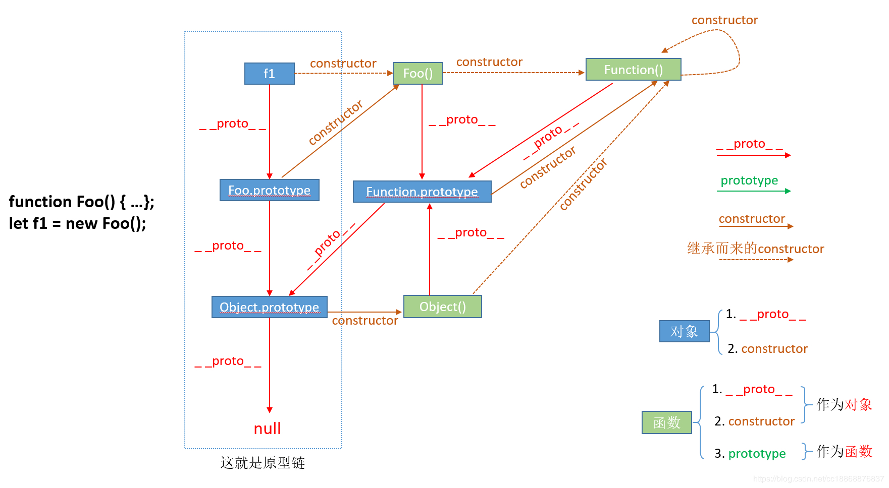

#### 原型、原型链

**prototype和__proto__之间的区别**

###### 1、prototype是函数才会有的属性，而__proto__是每个对象都有的属性。大多数情况下__proto__可以理解为“构造器的原型”，即__proto__ === constructor.prototype 

```
var a = {};
console.log(a.prototype);  //undefined
console.log(a.__proto__);  //Object {}

var b = function(){}
console.log(b.prototype);  //b {}
console.log(b.__proto__);  //function() {}
```

###### 2、__proto__的指向问题，其指向取决于对象创建时的实现方式
- 字面量方式

```
    var a = {};
    a.__proto__ === Object.prototype; // true
    a.__proto__ === a.constructor.prototype; // true
```

- 构造器方式

```
    function A() {};
    var a = new A();
    a.__proto__ === A.prototype; // true
    a.__proto__ === a.constructor.prototype; // true
```

- Object.create方式

```
    var a1 = {a:1}
    var a2 = Object.create(a1);
    console.log(a2.__proto__); //Object {a: 1}
    a2.__proto__ // {a: 1}
    a2.__proto__.__proto__ === Object.prototype // true
```

###### 3、什么是原型链？

```
因为__proto__是对象必有的属性，所以对象的引用关系可以以proto链的方式去查找其指向，最终找到的是null。

    function A(){};
    var a = new A();
    console.log(a.__proto__); //A {}（即构造器function A 的原型对象）
    console.log(a.__proto__.__proto__); //Object {}（即构造器function Object 的原型对象）
    console.log(a.__proto__.__proto__.__proto__); //null
```