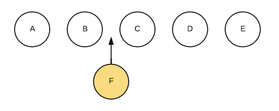
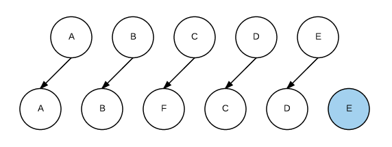

### v-for 循环内容为什么 key 不可以是 index，如果是 index 会怎么样？

> 首先 key 的值没有说不可以是 index(如果不会对这个列表做增删改操作)，只是 index 的值会对性能以及渲染造成影响以及会产生 bug。

为什么说会有性能影响呢？

1、性能相关数据变化的时候，Diff 只在同一层级的节点作比较。 **如果节点类型不同，直接干掉前面的节点，再创建并插入新的节点，不会再比较这个节点以后的子节点了。** **如果节点类型相同，则会重新设置该节点的属性，从而实现节点的更新。**

举个例子：我们希望在 B 和 C 之间插入一个元素 

Diff 算法的默认做法是这样的，即把 C 更新成 F，D 更新成 C，E 更新成 D 最后再插入 E。

所以我们需要有一个标识来直接作为插入依据，这种做法会极大提高了更新 DOM 的效率。 

2、bug 问题（）

使用 index 作为 key 的时候，会出现展示错误。

加入一个 list 中，第二条数据是选中的状态。那么如果我删除掉第二条数据之后，接下来的 list 下标会自动向上提升，这样会导致原本的第三条是选中状态，因为 vue 始终理解的是 index 下标为 1 的时候是选中的，这样会造成展示上的错误。这种情况其实也是看需求，理论上说这既是缺陷也是正常的逻辑。

### Vue 的 template 为什么不用 this 就可以找到对应的参数？

### 为什么数组通过下标改变值，Vue 不会触发页面刷新？

### 什么是 ast 抽象语法树？

https://segmentfault.com/a/1190000016231512

github 解释什么是 ast

https://github.com/answershuto/learnVue/blob/master/vue-src/compiler/parser/index.js#L53

### Vue 是如何绑定事件的？

https://juejin.cn/post/6844903919290679304

参考文章：

https://mp.weixin.qq.com/s/6k2GvANHdUA13Z2Y5gt-Zw
