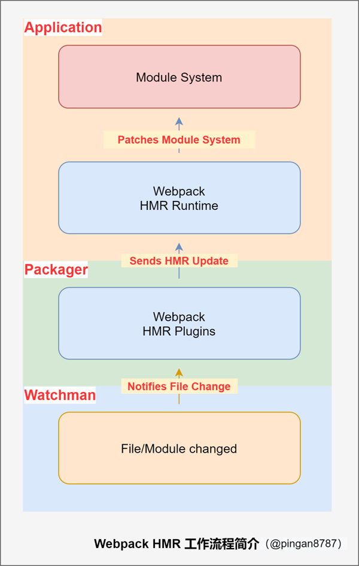
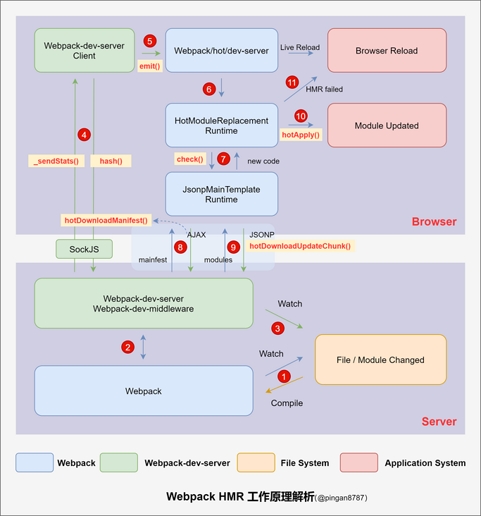
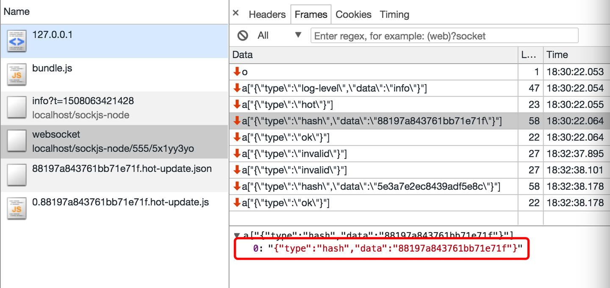
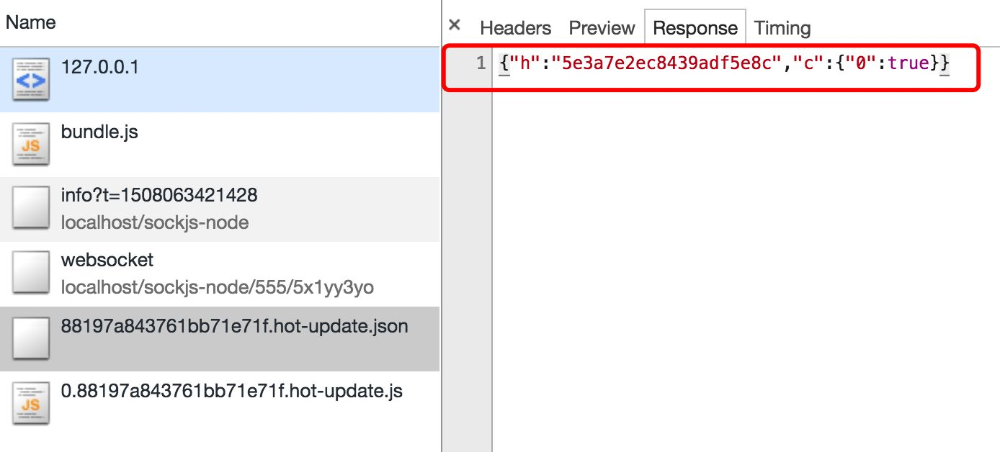
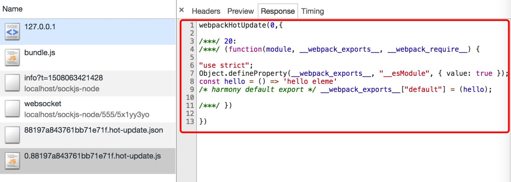

# 关于热更新

## 什么是热更新

其实开篇本身不应该去介绍什么是热更新，大家都晓得这个是什么东东。

> HMR 主要功能是会在应用程序运行过程中替换、添加或删除模块，而无需重新加载整个页面。

## 热更新的工作机制

### 大致在浏览器上的表现

当你启动本地项目时，webpack 会为你创建一个 socket，这个 socket 会监听来自文件变更。所以每次你修改代码的时候，你会发现浏览器会做一个 fetch 请求`http://localhost:8080/app.0ef92322bad11c72.hot-update.json`，然后紧接着会请求一个脚本文件`http://localhost:8080/app.b33a12f93074fb68.hot-update.js`。做完如下操作，你就会发现自己修改的代码就在浏览器上生效了。

#### 先看我盗的图



#### 梳理流程

根据上面的图来自下而上查看：

1、当 Webpack（Watchman） 监听到项目中的文件/模块代码发生变化后，将变化通知 Webpack 中的构建工具（Packager）即 HMR Plugin；

2、然后经过 HMR Plugin 处理后，将结果发送到应用程序（Application）的运行时框架（HMR Runtime）；

3、最后由 HMR Runtime 将这些发生变化的文件/模块更新（新增/删除或替换）到模块系统中。

### 了解 webpack 的中间件

[Webpack-dev-server](https://www.npmjs.com/package/webpack-dev-server) ：一个服务器插件，相当于 express 服务器，启动一个 Web 服务，只适用于开发环境；

[Webpack-dev-middleware](https://www.npmjs.com/package/webpack-dev-middleware) ：一个 Webpack-dev-server 的中间件，作用简单总结为：通过 watch mode，监听资源的变更，然后自动打包。

[Webpack-hot-middleware](https://www.npmjs.com/package/webpack-hot-middleware) ：只能结合 Webpack-dev-middleware 使用的中间件，它可以实现浏览器的无刷新更新，也就是 HMR；

### 整体工作流

#### 再看我拿来的图



第一步：webpack 监听文件的变化：当`npm run start`的时候，我们通过启动`Webpack-dev-server`本地服务，并且启动 webpack 的 watch 模式。同时`Webpack-dev-middleware`这个中间件也被初始化，通过调用 `startWatch()` 方法对文件系统进行 watch，当文件出现变动的时候，就会重新编译文件并放置到内存当中。

> 为什么放置到内存当中？我们都知道开启本地服务时 node 创建了一份虚拟内存，但是本地编译也是按照咱们的配置项进行的，只是编译的结果并没有写入到 output 目录下。这么做的好处是放置在内存会使得访问速度更快一些。

---

> 当文件更改的时候编译操作是全部编译还是只编译更改的文件？

```js
// webpack-dev-middleware/lib/Shared.js
if (!options.lazy) {
    var watching = compiler.watch(options.watchOptions, share.handleCompilerCallback);
    context.watching = watching;
}
```

第二步：创建 ws 来同步编译的状态，通过中间件`Webpack-dev-server`创建长链接，然后将 webpack 编译的各个阶段同步给浏览器端。通过监听`compiler`的 done 事件来发送 hash 值到浏览器端。

```javascript
// webpack-dev-server/lib/Server.js
compiler.plugin('done', (stats) => {
    // stats.hash 是最新打包文件的 hash 值
    this._sendStats(this.sockets, stats.toJson(clientStats));
    this._stats = stats;
});

Server.prototype._sendStats = function (sockets, stats, force) {
    if (
        !force &&
        stats &&
        (!stats.errors || stats.errors.length === 0) &&
        stats.assets &&
        stats.assets.every((asset) => !asset.emitted)
    ) {
        return this.sockWrite(sockets, 'still-ok');
    }
    // 调用 sockWrite 方法将 hash 值通过 websocket 发送到浏览器端
    this.sockWrite(sockets, 'hash', stats.hash);
    if (stats.errors.length > 0) {
        this.sockWrite(sockets, 'errors', stats.errors);
    } else if (stats.warnings.length > 0) {
        this.sockWrite(sockets, 'warnings', stats.warnings);
    } else {
        this.sockWrite(sockets, 'ok');
    }
};
```

> socket 一般会发送一些什么东西呢？当浏览器通过 ws 接收到 type 为 hash 消息后会将 hash 值暂存起来，当接收到 type 为 ok 的消息后对应用执行 reload 操作，如下图所示，hash 消息是在 ok 消息之前。



在 reload 操作中，webpack-dev-server/client 会根据 hot 配置决定是刷新浏览器还是对代码进行热更新（HMR）。代码如下：

```js
// webpack-dev-server/client/index.js
hash: function msgHash(hash) {
    currentHash = hash;
},
ok: function msgOk() {
    // ...
    reloadApp();
},
// ...
function reloadApp() {
    // ...
    if (hot) {
        log.info('[WDS] App hot update...');
        const hotEmitter = require('webpack/hot/emitter');
        // 工作转交回 Webpack
        hotEmitter.emit('webpackHotUpdate', currentHash);
        // ...
    } else {
        log.info('[WDS] App updated. Reloading...');
        self.location.reload();
    }
}
```

第三步：webpack 接收到最新 hash 值验证并请求模块代码，在这一步，其实是 webpack 中三个模块（三个文件，后面英文名对应文件路径）之间配合的结果，首先是 webpack/hot/dev-server（以下简称 dev-server） 监听第二步中 `webpack-dev-server/client` 发送的 `webpackHotUpdate` 消息，调用 `webpack/lib/HotModuleReplacement.runtime`（简称 HMR runtime）中的 `check` 方法，检测是否有新的更新，在 `check` 过程中会利用 `webpack/lib/JsonpMainTemplate.runtime`（简称 jsonp runtime）中的两个方法 `hotDownloadUpdateChunk` 和 `hotDownloadManifest` ， 第二个方法是调用 AJAX 向服务端请求是否有更新的文件，如果有将发更新的文件列表返回浏览器端，而第一个方法是通过 jsonp 请求最新的模块代码，然后将代码返回给 HMR runtime，HMR runtime 会根据返回的新模块代码做进一步处理，可能是刷新页面，也可能是对模块进行热更新。



<center style="font-size: 12px;color: #666;">通过hotDownloadManifest查询变更hash</center>

```js
// webpack\lib\JsonpMainTemplate.runtime.js
// hotDownloadManifest 定义 Line 22
function hotDownloadManifest(requestTimeout) {
    return new Promise(function (resolve, reject) {
        try {
            var request = new XMLHttpRequest();
            var requestPath = $require$.p + $hotMainFilename$;
            request.open('GET', requestPath, true);
            request.timeout = requestTimeout;
            request.send(null);
        } catch (err) {
            return reject(err);
        }
        request.onreadystatechange = function () {
            // ...
        };
    });
}
```



<center style="font-size: 12px;color: #666;">通过hotDownloadUpdateChunk请求变更代码块</center>

```js
// webpack\lib\JsonpMainTemplate.runtime.js
// hotDownloadManifest 定义 Line 12
function hotDownloadUpdateChunk(chunkId) {
    // 创建 script 标签，发起 JSONP 请求
    var head = document.getElementsByTagName('head')[0];
    var script = document.createElement('script');
    script.type = 'text/javascript';
    script.charset = 'utf-8';
    script.src = $require$.p + $hotChunkFilename$;
    $crossOriginLoading$;
    head.appendChild(script);
}
```

第四步：HotModuleReplacement.runtime 对模块进行热更新，这一步是整个模块热更新（HMR）的关键步骤，而且模块热更新都是发生在 HMR runtime 中的 hotApply 方法中。

```js
// webpack/lib/HotModuleReplacement.runtime
function hotApply() {
    // ...
    var idx;
    var queue = outdatedModules.slice();
    while (queue.length > 0) {
        moduleId = queue.pop();
        module = installedModules[moduleId];
        // ...
        // remove module from cache
        delete installedModules[moduleId];
        // when disposing there is no need to call dispose handler
        delete outdatedDependencies[moduleId];
        // remove "parents" references from all children
        for (j = 0; j < module.children.length; j++) {
            var child = installedModules[module.children[j]];
            if (!child) continue;
            idx = child.parents.indexOf(moduleId);
            if (idx >= 0) {
                child.parents.splice(idx, 1);
            }
        }
    }
    // ...
    // insert new code
    for (moduleId in appliedUpdate) {
        if (Object.prototype.hasOwnProperty.call(appliedUpdate, moduleId)) {
            modules[moduleId] = appliedUpdate[moduleId];
        }
    }
    // ...
}
```

1. 找出过期模块 outdatedModules 和过期依赖 outdatedDependencies ；

```js
// webpack\lib\HotModuleReplacement.runtime.js
// 找出 outdatedModules 和 outdatedDependencies
function hotApply() {
    // ...
    var outdatedDependencies = {};
    var outdatedModules = [];
    function getAffectedStuff(updateModuleId) {
        var outdatedModules = [updateModuleId];
        var outdatedDependencies = {};
        // ...
        return {
            type: 'accepted',
            moduleId: updateModuleId,
            outdatedModules: outdatedModules,
            outdatedDependencies: outdatedDependencies,
        };
    }
    function addAllToSet(a, b) {
        for (var i = 0; i < b.length; i++) {
            var item = b[i];
            if (a.indexOf(item) < 0) a.push(item);
        }
    }
    for (var id in hotUpdate) {
        if (Object.prototype.hasOwnProperty.call(hotUpdate, id)) {
            // ... 省略多余代码
            if (hotUpdate[id]) {
                result = getAffectedStuff(moduleId);
            }
            if (doApply) {
                for (moduleId in result.outdatedDependencies) {
                    // 添加到 outdatedDependencies
                    addAllToSet(outdatedDependencies[moduleId], result.outdatedDependencies[moduleId]);
                }
            }
            if (doDispose) {
                // 添加到 outdatedModules
                addAllToSet(outdatedModules, [result.moduleId]);
                appliedUpdate[moduleId] = warnUnexpectedRequire;
            }
        }
    }
}
```

2. 从缓存中删除过期模块、依赖和所有子元素的引用；

```js
// webpack\lib\HotModuleReplacement.runtime.js
// 从缓存中删除过期模块、依赖和所有子元素的引用 Line 442
function hotApply() {
    // ...
    var idx;
    var queue = outdatedModules.slice();
    while (queue.length > 0) {
        moduleId = queue.pop();
        module = installedModules[moduleId];
        // ...
        // 移除缓存中的模块
        delete installedModules[moduleId];
        // 移除过期依赖中不需要使用的处理方法
        delete outdatedDependencies[moduleId];
        // 移除所有子元素的引用
        for (j = 0; j < module.children.length; j++) {
            var child = installedModules[module.children[j]];
            if (!child) continue;
            idx = child.parents.indexOf(moduleId);
            if (idx >= 0) {
                child.parents.splice(idx, 1);
            }
        }
    }
    // 从模块子组件中删除过时的依赖项
    var dependency;
    var moduleOutdatedDependencies;
    for (moduleId in outdatedDependencies) {
        if (Object.prototype.hasOwnProperty.call(outdatedDependencies, moduleId)) {
            module = installedModules[moduleId];
            if (module) {
                moduleOutdatedDependencies = outdatedDependencies[moduleId];
                for (j = 0; j < moduleOutdatedDependencies.length; j++) {
                    dependency = moduleOutdatedDependencies[j];
                    idx = module.children.indexOf(dependency);
                    if (idx >= 0) module.children.splice(idx, 1);
                }
            }
        }
    }
}
```

3. 将新模块代码添加到 modules 中，当下次调用 **webpack_require** (webpack 重写的 require 方法)方法的时候，就是获取到了新的模块代码了。

```js
// webpack\lib\HotModuleReplacement.runtime.js
// 将新模块代码添加到 modules 中 Line 501
function hotApply() {
    // ...
    for (moduleId in appliedUpdate) {
        if (Object.prototype.hasOwnProperty.call(appliedUpdate, moduleId)) {
            modules[moduleId] = appliedUpdate[moduleId];
        }
    }
}
```

## Q&A

### 为什么不能直接通过 socket 直接将更新的文件内容发送到浏览器？

> 查看了资料，感觉这个事情其实也是可以放在 socket 来做得，但是没有必要。socket 是通信的一种方式而已，它的作用更倾向于是传递简单的信息，并不需要把更多的功能放置在 socket 中去。

### 什么时候会整体刷新页面，什么时候会进行模块替换更新？

Webpack/hot/dev-server 监听浏览器端 webpackHotUpdate 消息，将新模块 hash 值传到客户端 HMR 核心中枢的 HotModuleReplacement.runtime ，并调用 check 方法检测更新，判断是浏览器刷新还是模块热更新。

```js
// webpack\hot\dev-server.js
// 1.监听 webpackHotUpdate Line 42
var hotEmitter = require('./emitter');
hotEmitter.on('webpackHotUpdate', function (currentHash) {
    lastHash = currentHash;
    if (!upToDate() && module.hot.status() === 'idle') {
        log('info', '[HMR] Checking for updates on the server...');
        check();
    }
});

var check = function check() {
    module.hot
        .check(true)
        .then(function (updatedModules) {
            if (!updatedModules) {
                // ...
                window.location.reload(); // 浏览器刷新
                return;
            }
            if (!upToDate()) {
                check();
            }
        })
        .catch(function (err) {
            /*...*/
        });
};

// webpack\lib\HotModuleReplacement.runtime.js
// 3.调用 HotModuleReplacement.runtime 定义的 check 方法 Line 167
function hotCheck(apply) {
    if (hotStatus !== 'idle') throw new Error('check() is only allowed in idle status');
    hotApplyOnUpdate = apply;
    hotSetStatus('check');
    return hotDownloadManifest(hotRequestTimeout).then(function (update) {
        //...
    });
}
```

参考文档：

see: <https://segmentfault.com/a/1190000022950736>
